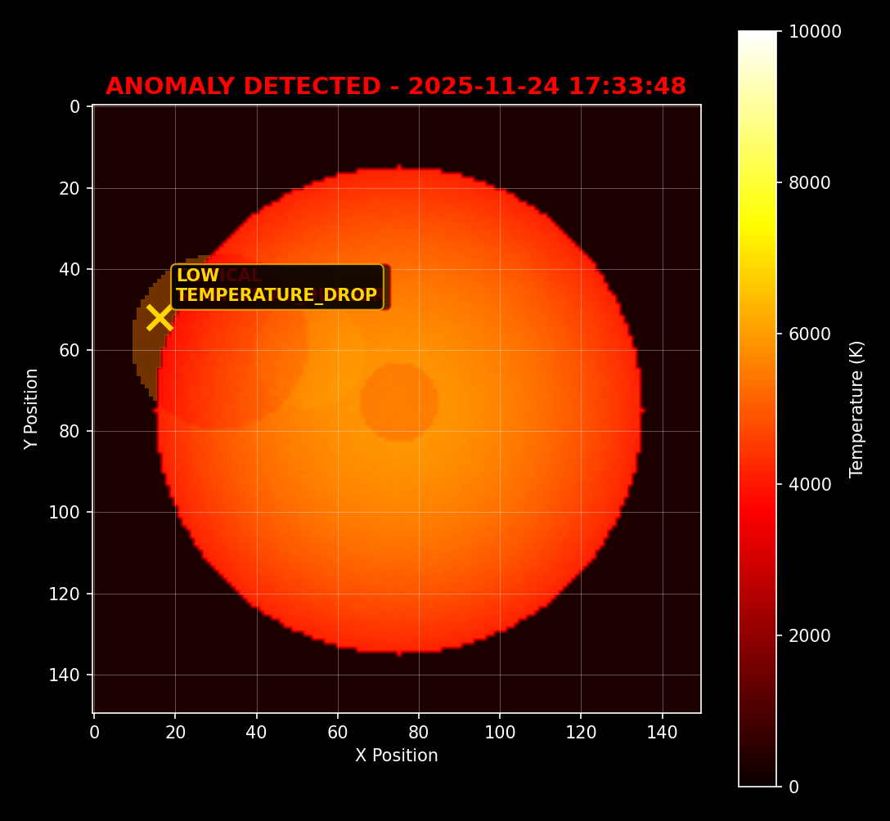

# Radiometric Anomaly Detection System

## Real-time Thermal Monitoring with Statistical Analysis

A system that monitors thermal patterns in real-time and automatically detects unusual temperature changes using statistical analysis.


_Example of real-time anomaly detection showing temperature spikes automatically identified by the system_

## Overview

This system monitors thermal data and detects anomalies by learning what "normal" temperature patterns look like, then alerting when something unusual happens. It uses statistical methods to minimize false alarms while catching real thermal events.

**What it does:**

- **Learns Normal Patterns**: Builds a baseline of typical temperature behavior
- **Detects Anomalies**: Identifies unusual temperature patterns in real-time
- **Reduces False Alarms**: Uses statistical analysis to avoid noise-triggered alerts
- **Documents Events**: Automatically captures images of detected anomalies
- **Provides Alerts**: Real-time notifications with severity levels

## How It Works

### 1. Learning Normal Behavior

The system watches thermal patterns over time and learns what's "normal" for each area being monitored. It accounts for:

- Daily temperature changes
- Natural temperature differences across the surface
- Expected random variations

### 2. Statistical Analysis

Each new thermal frame gets compared to the learned baseline using:

- **Z-Score Calculation**: Measures how far a temperature reading is from normal (in standard deviations)
- **Pixel Clustering**: Groups nearby anomalous pixels to identify real events vs random noise
- **Confidence Scoring**: Calculates how likely each detection is to be a real anomaly

### 3. Anomaly Classification

The system categorizes detected anomalies by:

- **Severity**: LOW, MEDIUM, HIGH, CRITICAL based on how unusual the temperature is
- **Type**: Temperature increases, decreases, or unusual patterns
- **Location**: Identifies the center and affected area of thermal events

### 4. Alerting and Documentation

When anomalies are found:

- Automatic screenshot with highlighted anomaly areas
- Real-time dashboard alerts showing severity level
- Detailed data including temperature differences and confidence scores

## Statistical Methods

### Detection Thresholds

The system uses standard deviation (σ) to measure how unusual a temperature reading is:

- **2-3σ**: LOW severity - slightly unusual but probably not important
- **3-4σ**: MEDIUM severity - worth paying attention to
- **4-5σ**: HIGH severity - likely a real issue
- **>5σ**: CRITICAL - definitely something wrong

### How the Baseline Works

- Analyzes data in 5-minute time buckets
- Adapts to environmental changes over time
- Uses multiple nearby pixels to distinguish real events from sensor noise

### Reducing False Alarms

- Requires at least 5 connected pixels to trigger an alert
- Checks that anomalies persist over multiple frames
- Calculates confidence scores based on multiple factors

### Statistical Concepts

**Z-Score**: Shows how unusual a temperature is compared to historical data. A Z-score of 3 means the temperature is 3 standard deviations from average - this should only happen 0.3% of the time normally.

**Standard Deviation (σ)**: Measures how spread out temperature readings usually are:

- 68% of normal readings are within 1σ of average
- 95% are within 2σ
- 99.7% are within 3σ
- Anything beyond 3σ is statistically unusual

**Confidence Scores**: The probability that a detected anomaly is real versus just random variation.

## System Specs

### Performance

- **Processing Speed**: Analyzes 10 frames per second
- **Resolution**: 150×150 grid (22,500 temperature points)
- **Response Time**: Detects anomalies in under 100ms
- **Memory Usage**: Less than 100MB

### Features

- **Web Dashboard**: Live thermal visualization in your browser
- **API Access**: REST endpoints for integration with other systems
- **Configurable Alerts**: Adjust sensitivity and notification settings
- **Data Export**: Save historical data and events
- **Multiple Sensors**: Can monitor several thermal sources at once

### Deployment

- **Standalone**: Run on a single computer
- **Network**: Connect multiple sensors across a facility
- **Cloud**: Remote monitoring and management
- **Edge**: Local processing for fast response times

## Use Cases

### Industrial Applications

- **Equipment Monitoring**: Detect overheating motors, bearings, machinery
- **Process Control**: Monitor manufacturing temperatures
- **Maintenance**: Get early warning before equipment fails
- **Safety**: Automated monitoring for compliance

### Building/Infrastructure

- **Energy Efficiency**: Find heat loss and insulation problems
- **Electrical Systems**: Detect overheating components
- **HVAC**: Monitor heating and cooling performance
- **Fire Prevention**: Early detection of heat buildup

### Quality Control

- **Manufacturing**: Ensure consistent process temperatures
- **Product Testing**: Verify temperature requirements
- **Environmental**: Monitor critical conditions
- **Documentation**: Automatic logging for audits

## Getting Started

### Requirements

- **OS**: Windows 10/11, Linux, or macOS
- **Python**: Version 3.9 or newer
- **RAM**: 4GB minimum (8GB better for multiple sensors)
- **Storage**: 1GB for the system plus space for historical data
- **Network**: Internet connection for the web interface

### Installation

```bash
# Download the code
git clone <repository-url>
cd radiometric-model-poc
pip install -r requirements/base.txt

# Start the system
python -m src.radiometric_engine.main --mode web
```

### Setup Steps

1. **Open Dashboard**: Go to `http://localhost:5000` in your browser
2. **Wait for Baseline**: Let it run 15-30 minutes to learn normal patterns
3. **Adjust Settings**: Configure sensitivity and alert preferences
4. **Test Alerts**: Set up notifications and test them

### Dashboard Overview

- **Live Heatmap**: Real-time temperature visualization
- **Anomaly Highlights**: Red boxes around detected anomalies
- **Stats Panel**: System performance and detection metrics
- **Controls**: Force anomalies for testing and adjust settings
- **Alert Log**: History of all detected events

## Production Setup

### Environment Settings

```bash
# For production use
export PRODUCTION_MODE=true
export LOG_LEVEL=WARNING
export FLASK_DEBUG=false

# Performance tuning
export UPDATE_FREQUENCY_HZ=10.0
export GRID_WIDTH=150
export GRID_HEIGHT=150
```

### System Integration

- **Database**: Store historical data and baselines
- **Alerts**: Connect to email, SMS, or other notification systems
- **Security**: Set up user access controls and SSL
- **Backups**: Automatic backup of baseline data

### Performance Metrics

- **Accuracy**: >95% detection rate for real thermal events
- **False Alarms**: <2% under normal conditions
- **Speed**: Sub-second anomaly detection
- **Uptime**: Designed for 24/7 operation
- **Reliability**: >99.9% successful frame processing

## Support and Development

### Troubleshooting

- Check that Python dependencies are installed correctly
- Verify the web interface is accessible at `localhost:5000`
- For slow performance, try reducing the update frequency
- Check log files for detailed error information

### Further Development

- The code is modular and can be extended for specific use cases
- API endpoints allow integration with existing monitoring systems
- Statistical thresholds can be customized for different applications
- Multiple thermal sources can be monitored simultaneously

### Contact

For technical questions, feature requests, or implementation help, please reach out through the project repository or contact the development team.

---

_This system provides a practical implementation of statistical anomaly detection for thermal monitoring applications. It's designed to be both accessible for research and robust enough for real-world deployment._
